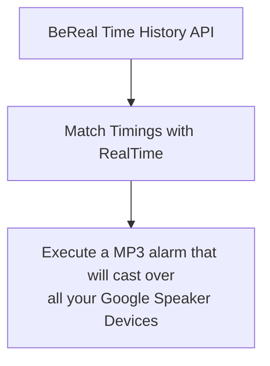

<a name="readme-top"></a>

[![LinkedIn][linkedin-shield]][linkedin-url]
[![Issues][issues-shield]][issues-url]
[![MIT License][license-shield]][license-url]
[![Discord][discord-shield]][discord-url]

<!-- PROJECT -->
<br />
<div align="center">
  <a href="https://github.com/jorickjuh/Google-BeReal-Alarm">
    
  </a>

<h3 align="center">Google BeReal Alarm</h3>

  <p align="center">
    A alarm that will play a sound to all your Google Speakers when a BeReal sets off 
    <br />
    <a href="https://github.com/jorickjuh/Google-BeReal-Alarm/wiki/Getting-it-Up-and-Running"><strong>Setting it up »</strong></a>
    <br />
    <br />
    <a href="https://jorickbouw.nl/githubprojects/GBA/Demo">View Demo</a>
    ·
    <a href="https://github.com/jorickjuh/Google-BeReal-Alarm/issues">Report Bug</a>
    ·
    <a href="https://github.com/jorickjuh/Google-BeReal-Alarm/issues">Request Feature</a>
  </p>
</div>

<!-- TABLE OF CONTENTS -->
<details>
  <summary>Table of Contents</summary>
  <ol>
    <li>
      <a href="#about-the-project">About The Project</a>
      <ul>
        <li><a href="#how-does-it-work">How does it work?</a></li>
        <li><a href="#built-with">Built With</a></li>
      </ul>
    </li>
    <li>
      <a href="#getting-started">Getting Started</a>
      <ul>
        <li><a href="#prerequisites">Prerequisites</a></li>
        <li><a href="#installation">Installation</a></li>
      </ul>
    </li>
    <li><a href="#contributing">Contributing</a></li>
    <li><a href="#license">License</a></li>
    <li><a href="#contact">Contact</a></li>
  </ol>
</details>

<!-- ABOUT THE PROJECT -->

# About The Project

The reason I started the project is because, I always forget to turn on my notifications when I get home. For that reason, I always miss the BeReal alarm. So I made this project to play a sound on all my Google speakers when the BeReal sets off.

## How does it work?

The project is made up of 3 parts:



I used the BeReal Time History API made by [@devinbaeton](https://github.com/devinbaeten) to get the latest BeReal. I then match the timings with real time time to get the exact time the BeReal set off. I then execute a MP3 alarm that will cast over all your Google Speaker Devices.

<p align="right">(<a href="#readme-top">back to top</a>)</p>

### Built With

- [![Python][python]][python-url]
- [![BeReal Time History][bth]][bth-url]

<p align="right">(<a href="#readme-top">back to top</a>)</p>

<!-- GETTING STARTED -->

## Getting Started

To get a local copy up and running follow these simple steps. If you want a more detailed guide, please visit the [wiki](https://github.com/jorickjuh/Google-BeReal-Alarm/wiki/Getting-it-Up-and-Running)

### Prerequisites

- python 3.8 or higher

  - [Windows](https://www.python.org/downloads/windows/)
  - [MacOS](https://www.python.org/downloads/mac-osx/)
  - [Linux](https://www.python.org/downloads/source/)

- python pip
  ```sh
  curl https://bootstrap.pypa.io/get-pip.py -o get-pip.py
  python get-pip.py
  ```

### Installation

1. Request a free API Key at [https://bereal.devin.fun](https://bereal.devin.fun)
2. Clone the repo
   ```sh
   git clone https://github.com/jorickjuh/Google-BeReal-Alarm.git
   ```
3. Install python requirements
   ```sh
   pip install -r requirements.txt
   ```
   
4. Enter your API and other changes in the `config.yml`
   ```yaml
   bereal_time_history_api: "YOUR_API_KEY"
   region: "YOUR_REGION"
   time_zone: "YOUR_TIMEZONE"
   ```
   
5. You will have to change the device_name to one of your google home device's name. If you have more than 1 google home, I would recommend you put all your google homes into a play group and place the play groups name in the device_name variable.
   ```yaml
   device_name: "YOUR_GOOGLE_HOME_NAME"
   alarm_url: "YOUR_MP3_ALARM_URL"
   ```

6. Run the script
   ```sh
   python main.py
   ```

<p align="right">(<a href="#readme-top">back to top</a>)</p>

<!-- CONTRIBUTING -->

## Contributing

Contributions are what make the open source community such an amazing place to learn, inspire, and create. Any contributions you make are **greatly appreciated**.

If you have a suggestion that would make this better, please fork the repo and create a pull request. You can also simply open an issue with the tag "enhancement".
Don't forget to give the project a star! Thanks again!

1. Fork the Project
2. Create your Feature Branch (`git checkout -b feature/AmazingFeature`)
3. Commit your Changes (`git commit -m 'Add some AmazingFeature'`)
4. Push to the Branch (`git push origin feature/AmazingFeature`)
5. Open a Pull Request

<p align="right">(<a href="#readme-top">back to top</a>)</p>

<!-- LICENSE -->

## License

Distributed under the MIT License. See `LICENSE` for more information.

<p align="right">(<a href="#readme-top">back to top</a>)</p>

<!-- CONTACT -->

## Contact

Discord: [@JorickJuh#4705](https://discord.gg/vNfKR6DGRg)

Project Link: [https://github.com/jorickjuh/Google-BeReal-Alarm](https://github.com/jorickjuh/Google-BeReal-Alarm)

<p align="right">(<a href="#readme-top">back to top</a>)</p>

<!-- MARKDOWN LINKS & IMAGES -->
<!-- https://www.markdownguide.org/basic-syntax/#reference-style-links -->

[forks-shield]: https://img.shields.io/github/forks/jorickjuh/Google-BeReal-Alarm.svg?style=for-the-badge
[forks-url]: https://github.com/jorickjuh/Google-BeReal-Alarm/network/members
[stars-shield]: https://img.shields.io/github/stars/jorickjuh/Google-BeReal-Alarm.svg?style=for-the-badge
[stars-url]: https://github.com/jorickjuh/Google-BeReal-Alarm/stargazers
[issues-shield]: https://img.shields.io/github/issues/jorickjuh/Google-BeReal-Alarm.svg?style=for-the-badge
[issues-url]: https://github.com/jorickjuh/Google-BeReal-Alarm/issues
[license-shield]: https://img.shields.io/github/license/jorickjuh/Google-BeReal-Alarm.svg?style=for-the-badge
[license-url]: https://github.com/jorickjuh/Google-BeReal-Alarm/blob/master/LICENSE.txt
[linkedin-shield]: https://img.shields.io/badge/-LinkedIn-black.svg?style=for-the-badge&logo=linkedin&colorB=555
[linkedin-url]: https://linkedin.com/in/jbouw
[discord-shield]: https://img.shields.io/badge/-Discord-black.svg?style=for-the-badge&logo=discord&colorB=555&logoColor=white
[discord-url]: https://discord.gg/vNfKR6DGRg
[product-screenshot]: images/screenshot.png
[python]: https://img.shields.io/badge/Python-417FB1?style=for-the-badge&logo=python&logoColor=FFE365
[python-url]: https://python.org/
[bth]: https://img.shields.io/badge/BeReal%20Time%20History-yellow?style=for-the-badge
[bth-url]: https://bereal.devin.fun/
